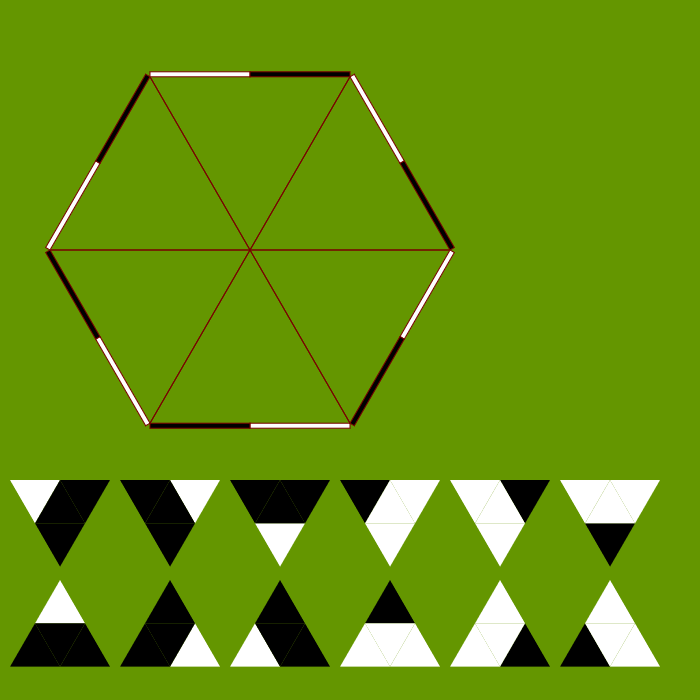
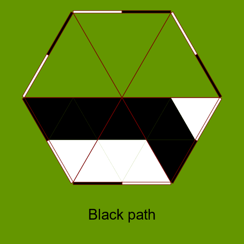
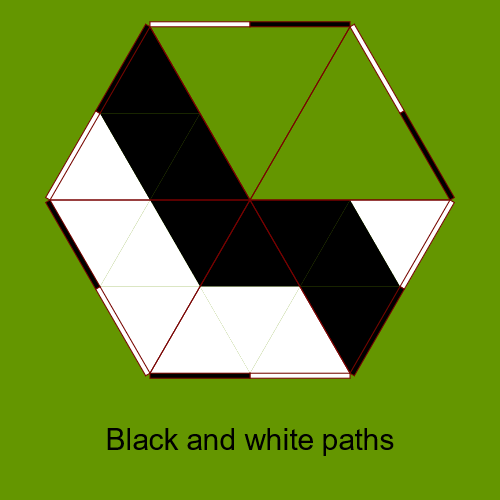
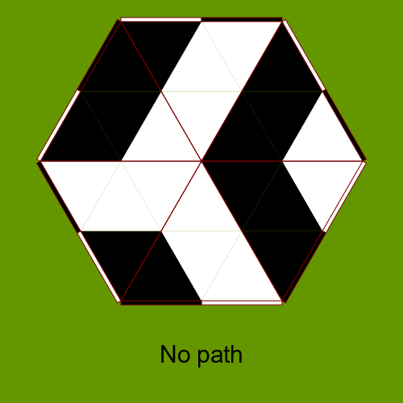
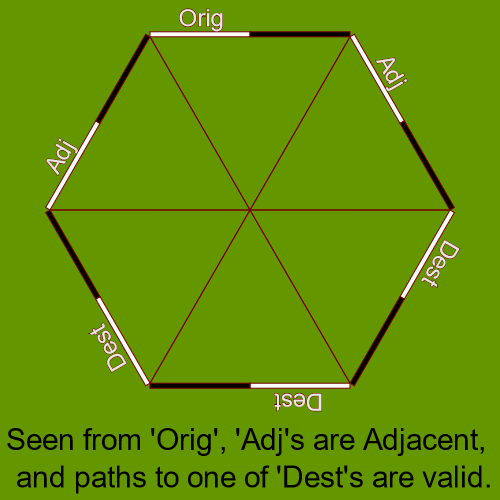

# The 17th Theorem Proving and Provers meeting (TPP 2021)

TPP (Theorem Proving and Provers) ミーティングは，
2005年から年に1回開催され，
定理証明系を作っている人から使う側の人まで幅広い人たちが集まり，
様々な側面からの話をしてアイディアの交換をしてきたものです．

ミーティング期間中の討論を大切にしたいと考えていますので，
出来上がった仕事の講演だけでなく，
進行中の仕事，未完成の仕事についての講演も歓迎します．
参加者には可能な限りご講演いただくことを期待しています．

TPP is a series of annual meetings for developers
as well as users of theorem provers.
Discussions from various aspects and exchanges
of ideas have taken place in the past meetings since 2005.

We regard the discussions during the meeting to be most important.
As such, not only the talks about completed work, but those about ongoing 
work and half-baked work are also welcome.
We hope all participants would consider giving a talk.

## 開催日程 / Date
2021年11月21日(日), 22日(月) / Sun. 21st to Mon. 22nd, November 2021.

## 会場 / Venue
北見工業大学 14号館 1階 E131講義室 / Kitami Institute of Technology, Building 14, 1st Floor, Room E131

発表・質疑応答等はZoomを利用してオンラインでも参加可能にする予定です.

なお, 新型コロナウイルス感染症 (COVID-19)の感染拡大状況に応じ,
全面的にオンライン開催となる可能性があります. 

11月上旬に決定してメーリングリストにてお知らせします. 

The talks and discussions will be available online using Zoom.

According to the spread of coronavirus infection (COVID-19), 
we may switch to a fully online meeting.

We will decide in the early November whether we go online,
and announce on the mailing list.

## 住所 / Address

〒090-8507 北海道北見市公園町165番地 / 165 Koen-cho, Kitami, Hokkaido 090-8507

[アクセス](https://www.kitami-it.ac.jp/access/) / [Access](https://www.kitami-it.ac.jp/access/)

## 懇親会 / Dinner Party
新型コロナウイルス感染症 (COVID-19)感染拡大防止のため,
対面での懇親会は開催しない予定です. 

In order to avoid the risk of COVID-19,
we are not going to hold a dinner party this year.

## 幹事 / Organizer

才川隆文 (名古屋大学) /
Takafumi Saikawa (Nagoya University), 

Email: tscompor&lt;at&gt;gmail.com

松田一徳 (北見工業大学) /
Kazunori Matsuda (Kitami Institute of Technology), 

Email: kaz-matsuda&lt;at&gt;kitami-it.ac.jp

## 参加申し込み / Registration
11/16(火)までに / Please register by 16th November from

[こちらから/here](https://docs.google.com/forms/d/e/1FAIpQLScbaL-rlDBnLCKPJFnQLoluu9KdRvL_AoLKtSDFSyvuAytmfw/viewform)

## プログラム / Technical Program

### Nov.21
* 13:00 **Opening** (10min)  
  才川 隆文 @ 名古屋大学

### Nov.22
* 12:00 **Closing** (10min)  
  才川 隆文 @ 名古屋大学

<!---
* <time (??:??)> **<title of the talk>** (<duration (?? min)>)([slides](<filename>))([preprint](<filename>)) 
   <name> @ <affiliation> 
   <abstsract>

* Break (20min)

* <time> **Dinner Party**
-->

## TPPmark
解答は才川宛(tscompor&lt;at&gt;gmail.com)にお送り下さい. / Please send your answer to Saikawa (tscompor&lt;at&gt;gmail.com).

以下の盤面を状態とした状態遷移系を考えます.

六角形の盤面は三角形6つに区切られていて,
盤面の外周の各辺は白黒2色に塗り分けられています.
この塗り分けをポートと呼びます. 

この盤面の各三角形にパネルをはめてゆきます. 
各パネルは小三角形4つからなり,
頂点を含む小三角形1つと, その他の3つは色が違います. 

- 初期状態：空盤面
- 状態遷移：盤面の空三角形のどれか1つに,  任意のパネルをはめる
- 終了判定：
    -  一つのポートから, そのポートが乗っている盤面外周辺と
       **隣り合っていない** 他の外周辺の同色のポートへ,
       「道」ができたら終了
    - 空三角形が無ければ終了

Consider the following state transition on a game board.

The board is a hexagon comprising six triangles.
Each of the outer edges of the hexagon is divided into black and white segments,
which we call "ports".

We are going to place triangular tiles onto the board.
Each tile consists of four smaller triangles, among which
one at some vertex of the tile is differently colored than the other three.

- Initial state: Empty board
- Transition: Placement of an arbitrary tile onto some empty triangle on the board.
- Termination conditions:
    - There is a "path" which connects one port to some same-colored port
      on a **non-adjacent** edge of the board.
    - There is no remaining empty triangle on the board.

  

### 問1
この状態遷移系を形式化して下さい

Formalize this system.

### 問2
可能な終了状態の盤面数を以下の三つに分類して計算し, それが正しいことを証明して下さい. 

1. 道ができていない盤面数
2. 白ポートから白ポートへの道のみ,
   あるいは黒ポートから黒ポートへの道のみができている盤面数
3. 白から白, 黒から黒, 両方の道ができている盤面数

Classify the final states of the board into the following three,
and count the number of each. Also verify the correctness of the counting.

1. Those with no path
2. Those with either only black paths or only white paths
3. Those with both black and white paths

### 問3
この状態遷移系を白黒ふたりのプレイヤーによるゲームとみなすことにします.
各プレイヤーは交互にパネルを置いてゆき,
白の道のみができたら白の勝ち, 黒の道のみができたら黒の勝ち,
それ以外は引き分けです. 

このゲームに必勝法は存在するでしょうか？

Regard this system as a game played by black and white,
each player taking turns placing tiles.
When a final state is reached with paths of only one color,
the corresponding player wins.
Otherwise the game ends in a draw.

Prove or disprove the existence of a winning strategy in this game.

### 謝辞 / Acknowledgements
このゲームはもともと北見工業大学の中村文彦さんが考案されたもので,
今回簡略化してTPPMarkの題材とさせて頂くにあたり, いろいろとご協力頂きました.
御礼申し上げます.

The above game was originally invented by Fumihiko Nakamura of
Kitami Institute of Technology.
We are very grateful for his help in
simplifying and using the game as a TPPMark problem.

<!---
### 解答 / Solutions
- <author> [<software>](<url>
-->

## これまでのTPP / Past TPPs
[TPP2020](https://aabaa.github.io/tpp2020/) /
[TPP2019](https://akihisayamada.github.io/tpp2019/) /
[TPP2018](https://ksk.github.io/tpp2018/) /
[TPP2017](https://aigarashi.github.io/TPP2017/) /
[TPP2016](http://pllab.is.ocha.ac.jp/~asai/tpp2016/) /
[TPP2015](https://sites.google.com/a/progsci.info.kanagawa-u.ac.jp/tpp2015/) /
[TPP2014](https://imi.kyushu-u.ac.jp/lasm/tpp2014/) /
[TPP2013](https://www.cs.shinshu-u.ac.jp/~okazaki/TPP2013/index.html) /
[TPP2012](https://www.math.s.chiba-u.ac.jp/tpp2012/) /
[TPP2011](https://staff.aist.go.jp/reynald.affeldt/tpp2011/) /
[TPP2010](https://www.math.nagoya-u.ac.jp/~garrigue/tpp10/) /
[TPP2009](https://ist.ksc.kwansei.ac.jp/~ktaka/TPP09/TPP09.html) /
[TPP2008](http://www.score.cs.tsukuba.ac.jp/~minamide/tpp/) /
[TPP2007](http://www.score.cs.tsukuba.ac.jp/~minamide/tpp/tpp07/index.html) /
[TPP2006](https://www.jaist.ac.jp/joint-workshop/TPSmeeting/2006_11/program.html) /
[TPP2005](https://www.jaist.ac.jp/joint-workshop/TPSmeeting/2005_11/program.html)
